# TSG Flow — pipeline de definição e execução

O fluxo de definição transforma visão de produto em tarefas executáveis. O fluxo de execução
consome essas tarefas uma por vez, protegendo cada entrega com gate, validação e checkpoint.

```mermaid
%%{init: {"theme":"base","flowchart":{"curve":"linear"}}}%%
flowchart LR
    subgraph definition["Definição e planejamento"]
        vision["Vision<br/>visão macro"]:::definition
        domainMap["Domain Map<br/>bounded contexts"]:::definition
        architectureBaseline["Architecture Baseline<br/>regras estruturais"]:::definition
        capabilityBacklog["Capability Backlog<br/>(opcional)"]:::definition
        domain["Domain<br/>um domínio"]:::definition
        prd["PRD<br/>o quê e por quê"]:::definition
        apiDecision{"Feature expõe API?"}:::decision
        contract["Contract<br/>OpenAPI 3.1"]:::apiDoc
        techspec["TechSpec<br/>backend / geral"]:::definition
        frontend["Frontend TechSpec<br/>(Contract se houver API)"]:::frontend
        tasks["Tasks<br/>fatias verticais"]:::definition

        vision --> domainMap --> architectureBaseline
        architectureBaseline --> domain
        architectureBaseline --> capabilityBacklog --> domain
        domain --> prd --> apiDecision
        apiDecision -->|sim| contract
        apiDecision -->|não| techspec
        contract --> techspec
        prd -.->|contexto obrigatório| frontend
        contract --> frontend
        techspec --> tasks
        frontend -.->|se houver frontend| tasks
    end

    subgraph execution["Execução por task"]
        orchestrator["Orchestrator<br/>coordena"]:::execution
        implementer["Implementer<br/>uma task"]:::execution
        focusedValidator["Validator<br/>focused / revalidation"]:::validation
        integrator["Integrator<br/>checkpoint-task"]:::execution
        taskDone["Task aprovada<br/>status done"]:::done
        fullValidator["Validator<br/>full do PRD"]:::validation
        prepare["Integrator<br/>prepare-integration"]:::execution
        reopen["Integrator<br/>reopen-task"]:::execution
        complete["Integrator<br/>complete-prd"]:::done
        blocked["Intervenção humana<br/>status blocked"]:::blocked

        orchestrator -->|próxima task| implementer
        implementer -->|implementação pronta| focusedValidator
        focusedValidator -->|reprovada e há tentativa| implementer
        focusedValidator -->|aprovada| integrator
        integrator --> taskDone
        taskDone -->|ainda há tasks| orchestrator
        orchestrator -->|todas as tasks concluídas| prepare
        prepare -->|branch atualizada| fullValidator
        fullValidator -->|bloqueio atribuível a task| reopen
        reopen -->|corrigir e revalidar| implementer
        fullValidator -->|FULL VALIDATION APROVADA| complete
        complete -->|base ou código mudou| prepare
        focusedValidator -->|preflight, limite ou bloqueio| blocked
        fullValidator -->|limite de correção| blocked
    end

    repo["Repositório alvo<br/>stack + CI"]:::input
    gate["Gate<br/>scripts/ai-flow/gate.sh"]:::gate
    adrs["docs/adr/<br/>decisões duráveis"]:::apiDoc
    architectureBaseline -.->|consulta / registra decisões| adrs
    techspec -.-> adrs
    frontend -.-> adrs

    tasks --> orchestrator
    repo --> gate
    gate -.->|pré-requisito do fluxo| orchestrator
    implementer -.->|gate behavioral ou static| gate
    focusedValidator -.->|gate behavioral ou static| gate
    fullValidator -.->|executa gate com --all-tests| gate

    classDef input fill:#f4f4f5,stroke:#52525b,color:#18181b
    classDef definition fill:#dbeafe,stroke:#2563eb,color:#172554
    classDef decision fill:#fef3c7,stroke:#d97706,color:#451a03
    classDef apiDoc fill:#dcfce7,stroke:#16a34a,color:#14532d
    classDef frontend fill:#f3e8ff,stroke:#9333ea,color:#581c87
    classDef execution fill:#e0e7ff,stroke:#4f46e5,color:#1e1b4b
    classDef validation fill:#ffedd5,stroke:#ea580c,color:#431407
    classDef gate fill:#ccfbf1,stroke:#0f766e,color:#134e4a
    classDef done fill:#dcfce7,stroke:#15803d,color:#14532d
    classDef blocked fill:#fee2e2,stroke:#dc2626,color:#450a0a
```

## Legenda

- **Contract** é opcional na trilha de features sem API.
- **Architecture Baseline** consolida as regras estruturais do sistema depois do Domain Map.
- **Capability Backlog** é opcional e ajuda a priorizar capacidades antes do detalhamento dos domínios
  e das features.
- **Frontend TechSpec** exige contrato quando há API; UI local pode declarar N/A.
- **ADRs** ficam em `docs/adr/`, com numeração global, e sobrevivem à remoção do PRD.
- **Gate** é preparado uma vez por repositório e depois executado pelos agentes de implementação e
  validação.
- **Full validation** ocorre depois dos checkpoints e da preparação da integração; mudança posterior
  de base ou código exige nova validação.
